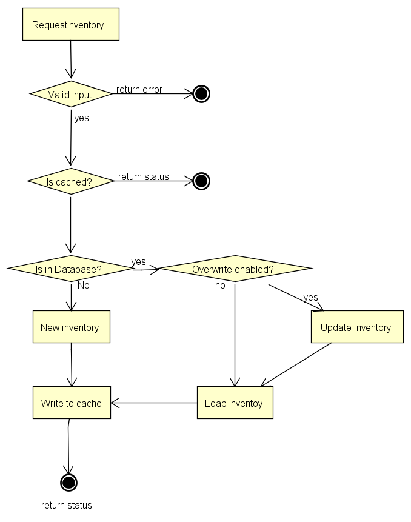

## RequestInventory

With RequestInventory you can create, update or overwrite inventories. 
To do so, we can call the following function: `Inventory.Server.RequestInventory`.

### Definition
```lua
function Inventory.Server.RequestInventory(name, metadata, overwrite)
```

### Parameters
**name**; The name of the inventory. This must be unique. Internally we will create a SHA256 hash based on the name supplied.

**metadata**: The metadata describes the inventory. Which in Lua consists of a table:

```lua
{
    theme = 0,
    style =  0,
    width =  8,
    height =  8,
    owner =  nil,
    transient =  false
}
```

The metadata table could look like so: 

**theme**: Which theme the inventory shall use, read the themes section for more information on this subject. Theme is a value between 0 and 255.

**style**: The inventory style this inventory uses, see style section for more information. Style is a value between 0 and 255.

**width**: The dimension of the inventory in the X axis (aka width). Width must be atleast be 1 and may not exceed 255.

**height**: The dimension of the inventory in the Y axis (aka height). Height must be atleast be 1 and may not exceed 255.

**owner**: The owner of the inventory, this is either a 64 character string or left null when there is no owner for the inventory (thus it can be publicly accessed).

**transient**: Wether this inventory is transient or not, see wiki for more information on transient inventories.

<hr>

**overwrite**: Setting this to true will overwrite any metadata of an already existing inventories.

### Returns

The RequestInventory will return an interger indicating what happened inside the function. Including errors when incorrectly used. If no errors arose, we will return the followed:

* `0` -> The requested inventory was already loaded or requested.
* `1` -> The requested inventory did not exist, we created one.
* `2` -> The requested inventory existed and we loaded it in.
* `3` -> We overwrote the current metadata _and_ loaded the inventory.

Possible errors and their meaning:

* `100` -> The given inventory name was empty or nil.
* `101` -> The metadata table was not present, empty or nil.
* `102` -> The given width was nil, below 1 or above 255.
* `103` -> The given height was nil, below 1 or above 255.
* `104` -> The given theme was nil, below 0 or above 255.
* `105` -> The given style was nil, below 0 or above 255.
* `106` -> The given owner was not a string or not a nil value.
* `107` -> The given owner string was bigger than 64 characters.
* `108` -> The given transient value was not a boolean.
* `109` -> The given overwrite value was not a boolean.
* `110` -> Inventories cannot have an owner when the inventory is marked as transient.

### Usage

```lua
local result = Inventory.Server.RequestInventory("hello-inventories", {
    theme = 0,
    style =  1,
    width =  2,
    height =  3,
    owner =  "steam:1010129183d32k",
    transient = false
}); 
```
The result will return either a error code or a status code.


### Accessibility

This function is accessible from the server only.

To access it, you need these files in your resource manifest:

```lua
"@synn-inventory/lib/inventory.lua",
"@synn-inventory/lib/inventory.server.lua",
```

<hr>

## Flowchart


